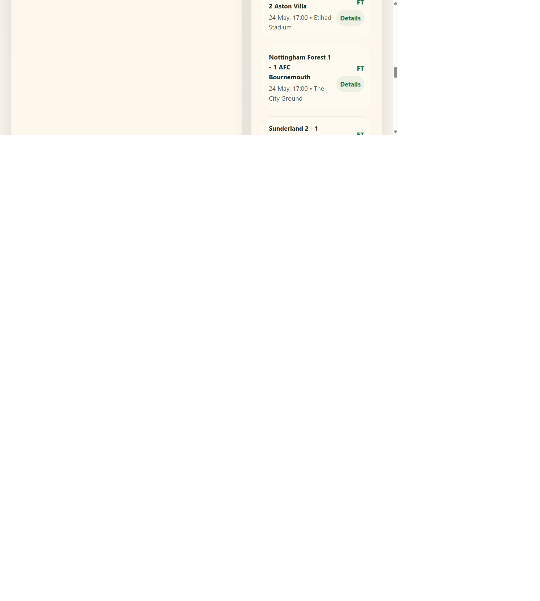

# Football Live Bet Tracker

A peer-to-peer football betting prototype where friends can sign in, browse games for today and tomorrow, offer custom odds to each other, lock a deal only after both sides are funded, and monitor live score updates from a free score source.

## Project Structure

- `frontend/` contains the React, Vite, and Firebase client.
- `backend/` contains the Express and Stripe API.
- the root `package.json` runs both folders through npm workspaces.

## Live Demo

- Repository: https://github.com/zebibu/football-live-bet-tracker
- GitHub Pages: https://zebibu.github.io/football-live-bet-tracker/

## Preview



## Features

- Sign-in and sign-up entry screen.
- Peer bet lobby with today, tomorrow, and upcoming football games.
- Custom offer flow where one friend proposes odds and another accepts the deal.
- Deposit and withdrawal screens with a Stripe-backed deposit server scaffold.
- Live football scoreboard feed with league switching.
- Profile view with wallet and locked deals.

## Live Data Source

The live panel currently uses ESPN public scoreboard JSON endpoints for:

- Premier League
- La Liga
- Serie A
- Ligue 1

The integration surface is isolated in `frontend/src/services/football.ts`, so the provider can be swapped later.

## Run Locally

```bash
npm install
npm run dev:full
```

This starts:

- the Vite frontend at `http://127.0.0.1:5173`
- the local backend at `http://127.0.0.1:8787`

## Stripe setup

Do not reuse any secret key that was pasted into chat. Revoke it in Stripe and create a fresh one.

Copy `backend/.env.example` to `backend/.env` and set:

```env
APP_ORIGIN=http://127.0.0.1:5173
STRIPE_SECRET_KEY=your_fresh_secret_key_here
```

Without that key, deposits are simulated locally so the prototype still works.

## Social sign-in setup

The app now has email/password, Google, Facebook, and Apple sign-in through Firebase Authentication.

Copy `frontend/.env.example` to `frontend/.env` and add these values:

```env
VITE_FIREBASE_API_KEY=your_firebase_web_api_key
VITE_FIREBASE_AUTH_DOMAIN=your-project.firebaseapp.com
VITE_FIREBASE_PROJECT_ID=your-project-id
VITE_FIREBASE_APP_ID=your-firebase-app-id
```

Then enable the providers in Firebase Authentication:

- Email/Password
- Google
- Facebook
- Apple

Facebook and Apple also require provider credentials configured in the Firebase console before the popup flow will work.

The sign-in screen also includes:

- friendlier Firebase auth errors
- a `Forgot password?` reset email action

## Build

```bash
npm run build
```

## Deploy

This repository includes a GitHub Pages workflow in `.github/workflows/deploy.yml` for the frontend build in `frontend/`.

The backend still needs its own deployment target such as Render, Railway, Fly.io, or a VPS.
